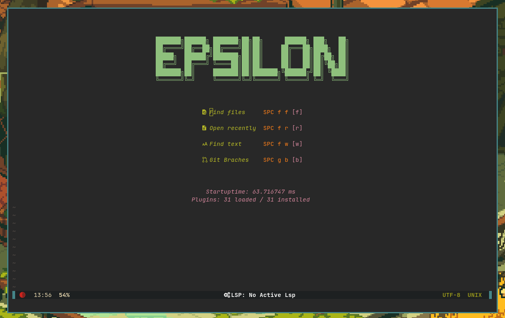
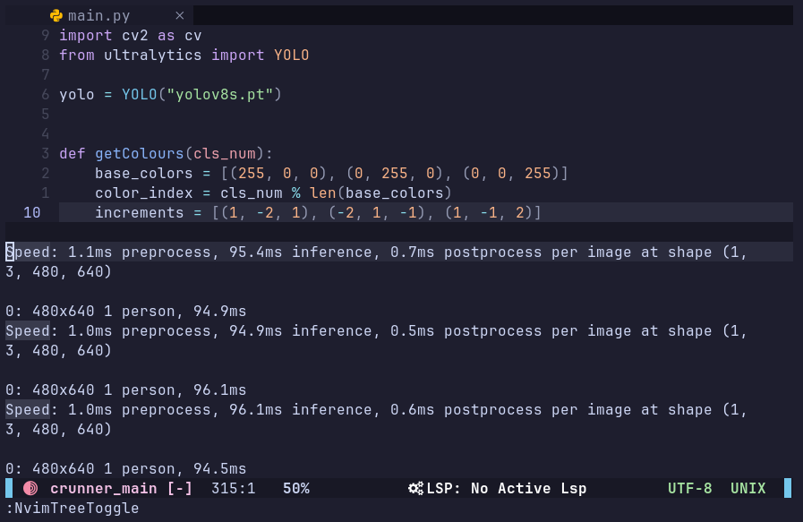
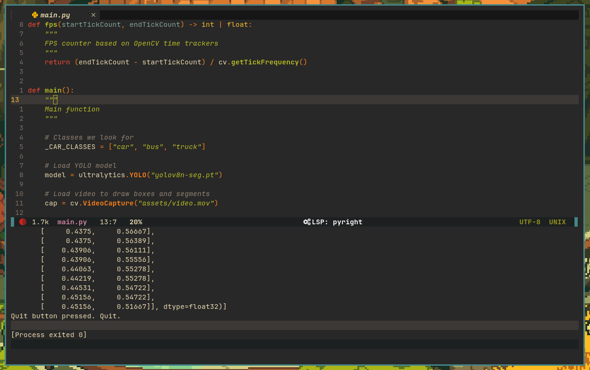
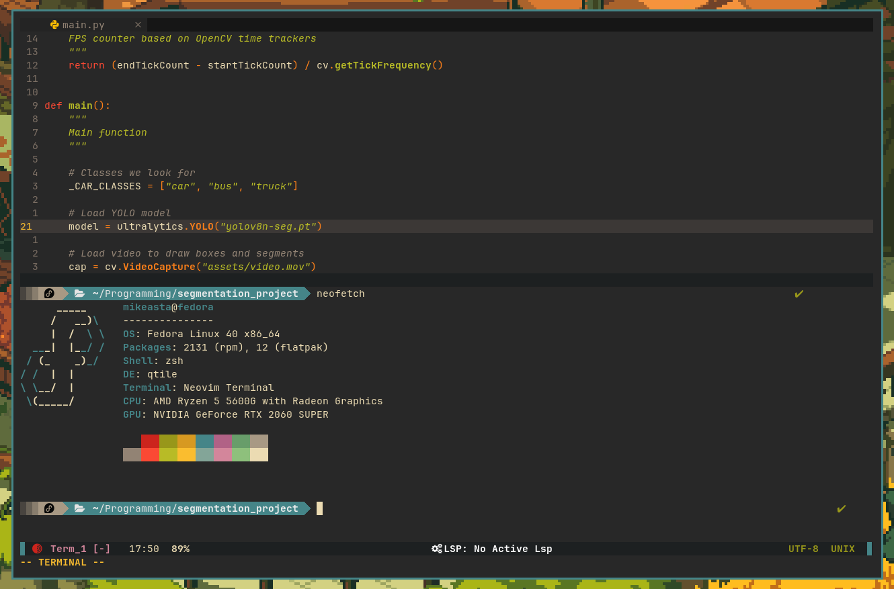

<h1>
EpsilonNvim
</h1>

⚡ Fast and lightweight Neovim config for Python Development ⚡

⚡ Startup time about 70 ms ⚡

🐍 Configurated LSP, linters and formaters for Python 🐍

🤖 Autosave with automatic code format 🤖

## 🔎 Preview

## 🔑 Crusial plugin keymaps
- SPC + ff - Telescope search
- SPC + r with focused code window - Compile and Run
- CTRL + n - Open Nvim Tree
    
## ✅ TODO
- [ ] Fix keymaps
- [ ] Add vertical line (respect to PEP row length limit)
- [ ] Implement DAP for Python
- [ ] Add formater and linter for C++ + DAP 
